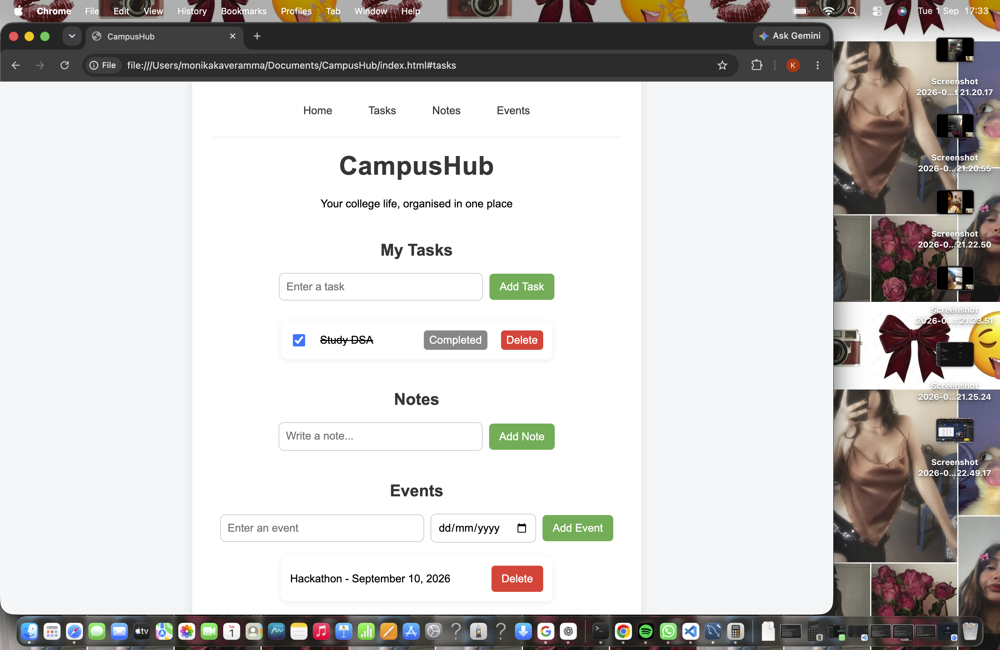

# CampusHub

A simple student productivity website for managing tasks, notes and events.

## Features

- Add and delete tasks
- Mark tasks as completed
- Add and delete notes
- Add and delete events
- Persistent data using MySQL
- Responsive design

## Screenshot

## Technologies Used

- HTML
- CSS
- JavaScript
- Node.js
- Express.js
- MySQL